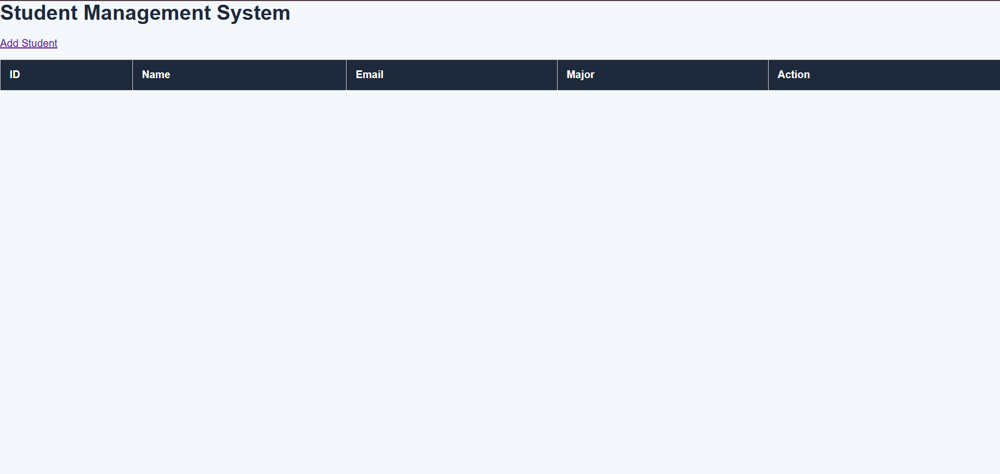
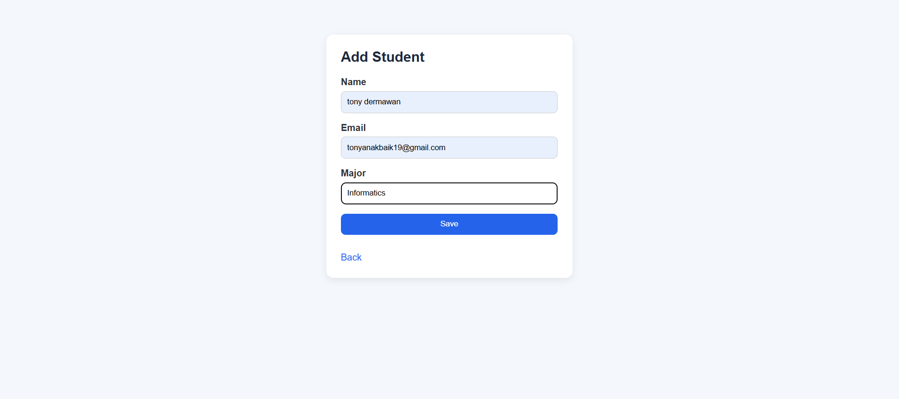
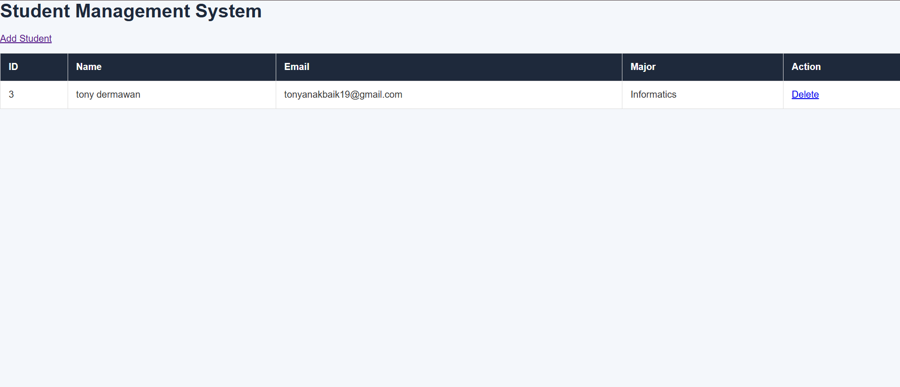

# Student Management System

A simple CRUD (Create, Read, Delete) web application built using **PHP and MySQL**.

This project allows users to manage student data including adding new students and deleting existing records.

## Features

* Display student data
* Add new student
* Delete student
* Simple and clean interface

## Technologies Used

* PHP
* MySQL
* HTML
* CSS
* XAMPP

## Project Structure

student-management-system
│
├── config.php
├── index.php
├── add.php
├── delete.php
├── style.css
└── README.md

## Database Setup

Database name:

student_db

Table name:

students

Columns:

id (INT, AUTO_INCREMENT, PRIMARY KEY)
name (VARCHAR)
email (VARCHAR)
major (VARCHAR)

## How to Run

1. Install XAMPP
2. Start Apache and MySQL
3. Place project inside the **htdocs** folder
4. Open browser and visit:

http://localhost/student-management-system

## Preview

### Dashboard

### Add Student Form

### Student Data

## Author

Tony Dermawan
UMSU Student
